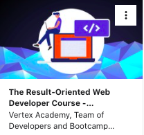

# Let's Travel
___
<!-- The live site can be found [here](https://stephaniequintana.github.io/Admin-Dashboard/) -->

> Let's Travel is currently a static site. I am presently adding in a node.js backend utilizing CRUD requests to add admin functionality, interactive user posting  (to include image uploads, geographical detail and contact capabilities).

___

<iframe src="https://giphy.com/embed/xSGbkEbX4xzfGfF2wf" width="100%" height="100%" style="position:absolute" frameBorder="0" class="giphy-embed" allowFullScreen></iframe>

<a href="https://giphy.com/gifs/xSGbkEbX4xzfGfF2wf">via GIPHY</a>

___

## Table of Contents
* [Design Plan](#design-plan)
* [Challenges Encountered and Knowledge Gained](#challenges-encountered-and-knowledge-gained)
* [Credits](#credits)
___

## Design Plan
- The major focus of the first phase of this project was the design layout utilizing Bootstrap. This proved to be incredibly fast and convenient. Although I can certainly appreciate the ease, I find the limitations not worthwhile. See challenges below for more detail.
___
## Challenges Encountered and Knowledge Gained
* I created the first phase of the site several months before returning to it. In the time I was away from the project, a new version of Bootstrap was released. Updating to it was a learning experience in itself. Albeit not difficult, it required a complete replacement of all components.
___
## Credits

This project is part of Udemy's [The Result-Oriented Web Developer Course - BOOTCAMP](https://www.udemy.com/course/result-oriented-web-developer-course/), created by Vertex Academy.
